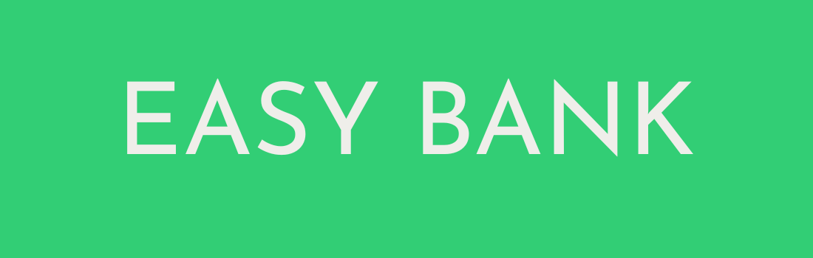

# 🌐 Easybank Landing Page — React + Tailwind CSS

This is a redesigned solution to the Frontend Mentor Easybank landing page challenge — built from scratch using React and Tailwind CSS for modern, responsive performance.

## Features

- 📱 Responsive design across all screen sizes

- ⚛️ Built with React (Component-based structure)

- 🎨 Styled using Tailwind CSS

- 🔄 Fully functional navigation with smooth scrolling

- 📄 Clean, semantic, accessible markup

- ✅ Pixel-perfect implementation of the Frontend Mentor design

## Running locally

```bash
git clone https://github.com/blue-crown-dev/easy-bank.git
cd easy-bank
npm install
npm start
```

## Deployment

The site is deployed live at [this link](https://easy-deposit.netlify.app)

## Built with

- React.js
- TailwindCSS
- Lucide icons

## Authors

Syed Umair Ali - Built the project - @SyedUmairCodes

## License

This project is licensed with an MIT license.

## Acknowledgements

- Frontend Mentor for the original challenge and assets.
- React & Tailwind CSS documentation for guidance.
- [Jess Chan aka CoderCoder](https://coder-coder.com) for her tutorial.
